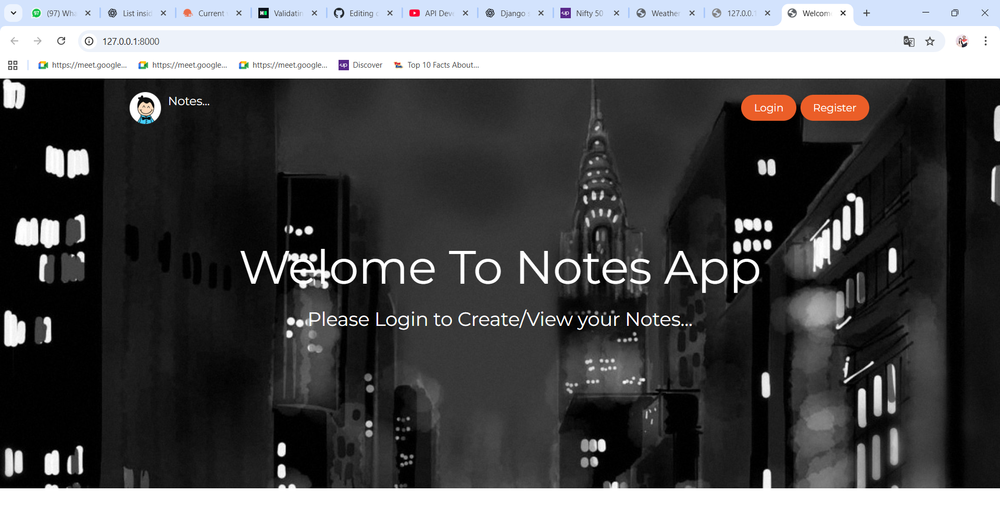
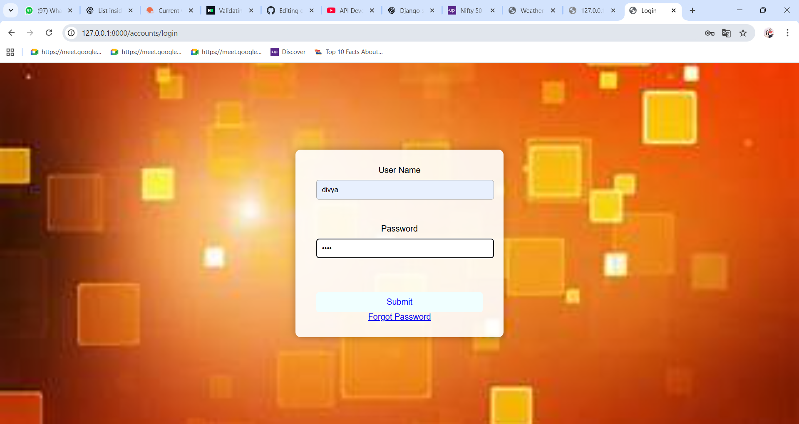
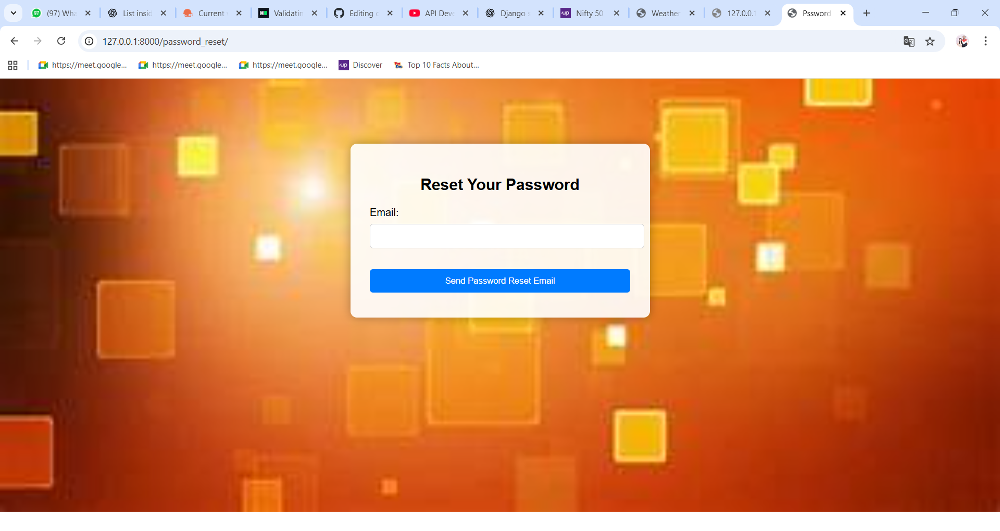
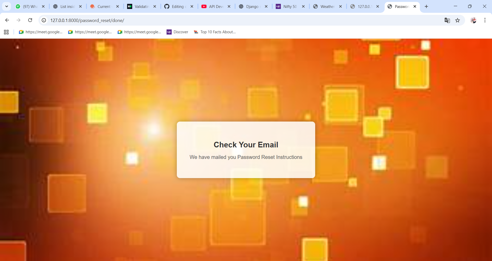
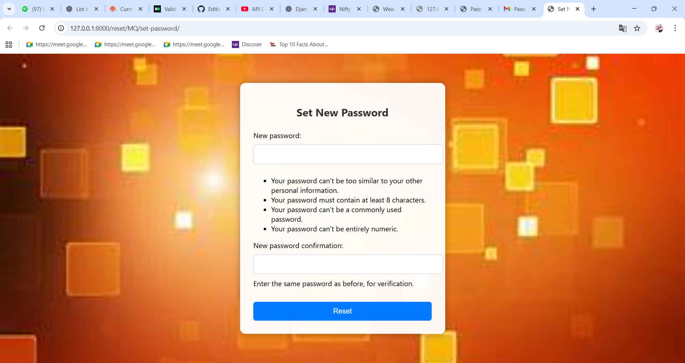
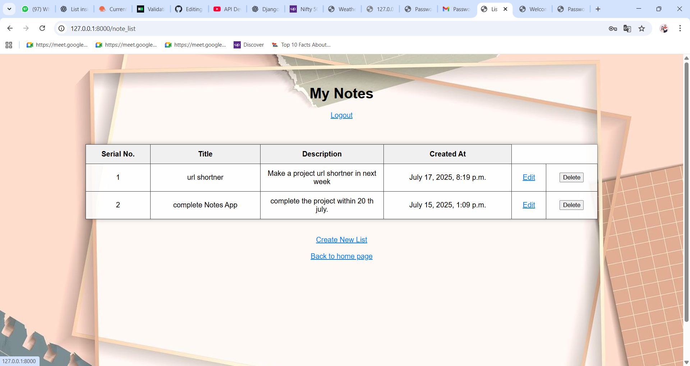
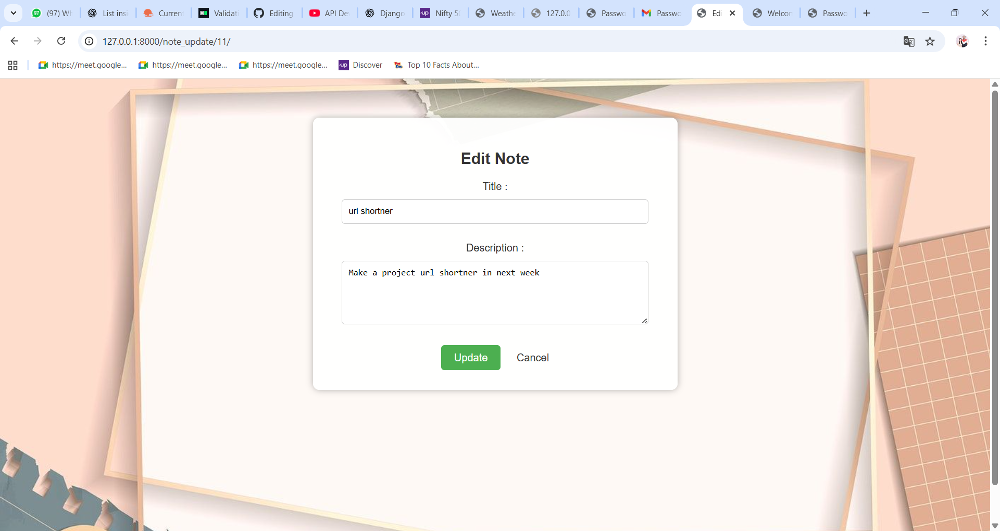
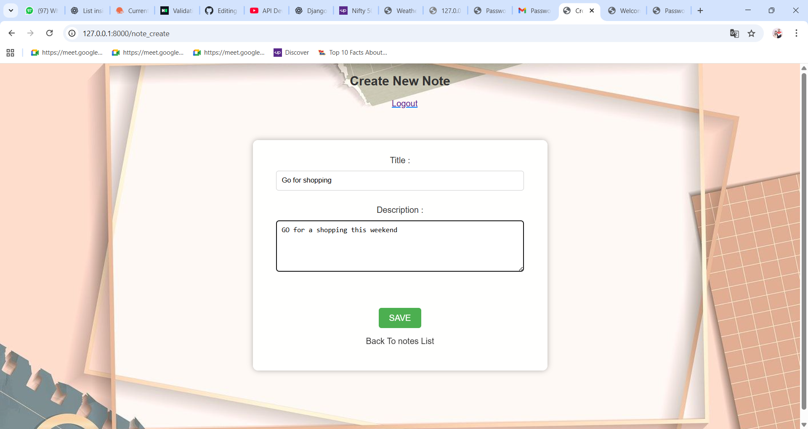

# django-notes-app

A simple Notes App built with Django that lets users add, edit, and delete notes.
Includes user authentication, Password Reset feature and a clean UI with background images.

---

##  Features

- Create new notes  
- Update existing notes  
- Delete notes  
- User authentication (register, login, logout)
- Email-based password reset using secure token URLs
- Clean UI with HTML/CSS and background images  
- PostgreSQL database support

---

## 🖼️ Screenshots

### 🏠 Main Dashboard



### 🔐 Login Page



### 🔑 Forgot Password 



### 📧 Password Reset Link Page



### 🔑 Password Reset Form



### 📝 Note List Page



### ✏️ Update Note Form




### ➕ Create New Note Form




## Tech Stack

-Python

-Django

-HTML/CSS

-PostgreSQL

-SMTP Email Backend


---

## Getting Started

Follow these steps to run the project locally

### 1.Clone the repo

```bash
git clone http://github.com/divyakp88/django-notes-app.git
cd django-notes-app
```
### 2. Create Virtual Environment

```bash
pip install virtualenvwrapper-win
mkvirtualenv test
```
### 3.Install requirements

```bash
pip install -r requirements.txt
```
### 4.Configure PostgreSQL Database

Upgrade your settings.py

DATABASES = {

    'default': {
    
        'ENGINE': 'django.db.backends.postgresql',
        
        'NAME': 'database_name',
        
        'USER': 'your_username',
        
        'PASSWORD': 'your_password',
        
        'HOST': 'localhost',
        
        'PORT': '5432',
        
    }
    
}

### 5.Run Migrations

```bash
python manage.py makemigrations
python manage.py migrate
```
### 6.Run the Development Server

```bash
python manage.py runserver
```
Visit http://127.0.0.1:8000/ to use the Notes App.

🙋‍♀️ **Author**

  Divya Anoop
  
  Python | Django Developer
  
  🌍 Based in India

